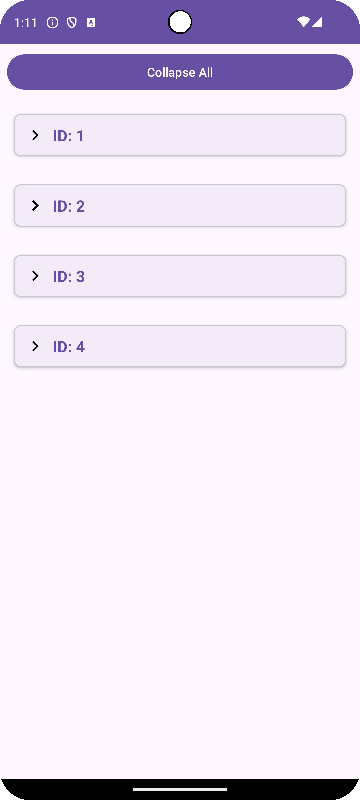
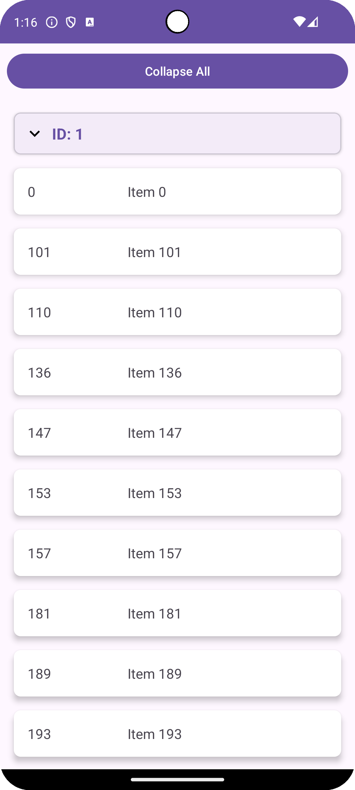

# Exercise

This is an Android **exercise** application. It fetches a list of items from a public API using Retrofit. The app makes use of a nested `RecyclerView` to present the grouped items. 

## Screenshots

  

    
    
Grouped By List ID

  

  

    
    
Sorted By Name

  

## Features

- **Data Retrieval**: The app fetches data from a public API using Retrofit.
- **Filtering**: Removes items with null or empty `name` values.
- **Sorting**: Groups items by `listId` and sorts them alphabetically by `itemName` within each group.
- **Nested `RecyclerView`**: Displays grouped items using an outer `RecyclerView` for each `listId` and an inner `RecyclerView` to list items belonging to that `listId`.
- **Background Processing with `HandlerThread`**: Sorting is done in a background thread using `HandlerThread` to avoid blocking the main UI thread.
- **Click to Expannd / Collapse all**: Click to expand or collapse each grouped list, with a single-click option to collapse all.
